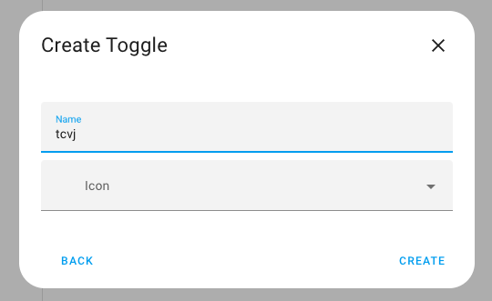
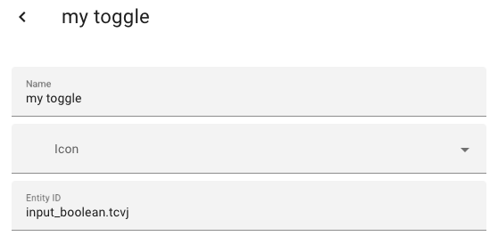
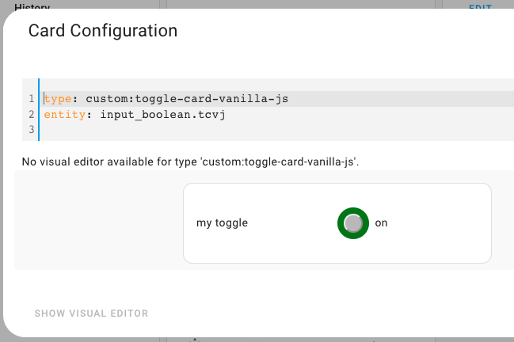
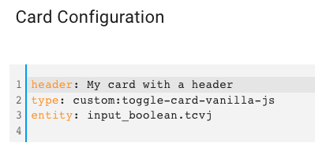
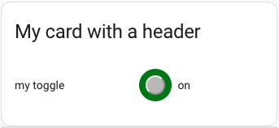
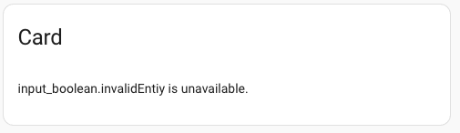
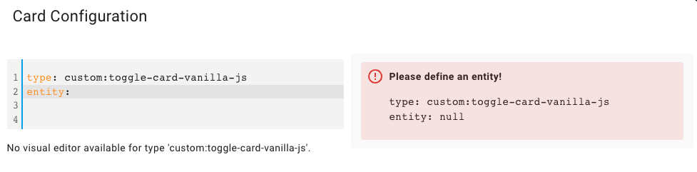

# Plain Vanilla JavaScript Toggle Card

 

Basic card functionality without a full development stack (and without a shadow dom)

 ***

* @published: May 2023
* @author: Elmar Hinz
* @workspace: `conf/www/tutor`
* @name: `toggle-card-vanilla-js`
* @id/prefix: `tcvj`

You learn:

* how to do a card with plain vanilla javascript
* a system to organize the class
* encapsulation of CSS by use of a prefix (BEM inspired)
* the full hass cycle of
* reading and writing a state
* how to bind the current context to the event callback

## Prerequisites

* tutorial 03: Hello world card plus
* you found your solution to reload `card.js` with the dashboard
* you know how to add a resource and a card

## Setup

Take the same steps as in the previous tutorials.

### The helper entity toggle

As the entity to toggle create a helper entity of the type `input_boolean`.  To
do so go to *Settings > Devices > Helpers*. Click *Add Helper* and select
*Toggle* from the dropdown. What the form calls *Name* becomes the name as well
as part of the *Entity ID*. Set `tcvj` as the name. This will create the *Entity
ID* `input_boolean.tcvj`.



You can select the newly created toggle from the list of helpers to edit it.
Change the name to `my toggle` or another choice. This will be the name, that
shows up as the label in  the card.



### In the dashboard

After registering the card as a resource you add it to the dashboard.



You can set a header, too.






## The Code

Find the code in the file named `card.js` alongside with this README.

### Organization of the class

The class is divided into five sections, *private properties*, *lifecycle*, *accessors*, *jobs* and *configuration defaults*.

The *lifecyle* functions are entry points that are triggered by lifecyle events.
They log to `console` to enable us to observe the order of the lifecyle events.
Remove in production code!

The *accessor* functions organize access to data and state. They are called by the jobs. The main purpose is to make the jobs more readable and clean.

The *jobs* are called by the lifecyle functions to get the job done.

The *configuration defaults* are related to the configuration. See previous tutorial.

### CSS

To keep the learning curve flat in this tutorial I go without a shadow dom.
Not using a shadow dom has the downside that the CSS is not encapsulated.  So I
use a prefix `tcvj-` to separate the CSS.  In the next tutorial I will show how
to replace prefixes by a shadow dom.

The handling of the prefix is inspired by BEM methodology (block, element,
modifier). The prefix is the equivalent to the block. Done in `doStyle()`:

```css
    .tcvj-error {
        text-color: red;
    }
    .tcvj-error--hidden {
        display: none;
    }
    .tcvj-dl {
        display: grid;
        grid-template-columns: repeat(2, minmax(0, 1fr));
    }
    .tcvj-dl--hidden {
        display: none;
    }
```

The outer tag `ha-card` and the class `.card-content` are required to style the
outer frames correctly.

### HTML

For reasons of semantics I decided to use a definition list to describe the
relation of label and value.

```js
    doCard() {
        this._elements.card = document.createElement("ha-card");
        this._elements.card.innerHTML = `
                <div class="card-content">
                    <p class="tcvj-error tcvj-error--hidden">
                    <dl class="tcvj-dl">
                        <dt class="tcvj-dt"></dt>
                        <dd class="tcvj-dd">
                            <span class="tcvj-toggle">
                                <span class="tcvj-button"></span>
                            </span>
                            <span class="tcvj-value">
                            </span>
                        </dd>
                    </dl>
                </div>
        `;
    }
```

### Lifecycle

The `hass()`trigger is called multiple times, but `setConfig()` can also be
called multiple times, especially inside the card editor.  `setConfig()` is
related to the configuration of the card while `hass()` gives access to the
runtime values of your home assistant system.

Our idea is to do the heavy loading of DOM creation only once. Then to trigger
tiny updates upon the lifecycle events `setConfig()` and `hass()`.

Unfortunately we are not allowed to add child elements directly within the
`constructor`. The lifecycle trigger `connectedCallback()` would be a typical
point to do it. But `setConfig()` and `hass()` are even called before it and we
already need access to the child elements here. That's why I place the
attachment of the child elements into `setConfig()`.  I use a flag `_isAttached`
to run it only once.

```js
    constructor() {
        super();
        console.log("ToggleCardVanillaJs.constructor()")
        this.doStyle();
        this.doCard();
    }

    setConfig(config) {
        console.log("ToggleCardVanillaJs.setConfig()")
        this._config = config;
        if (!this._isAttached) {
            this.doAttach();
            this.doQueryElements();
            this.doListen();
            this._isAttached = true;
        }
        this.doCheckConfig();
        this.doUpdateConfig();
    }
```

The issue itself gets resolved by using a shadow dom within the next tutorial.
The shadow dom takes child elements already within the constructor.

The `hass()` trigger is straight forward.

```js
    set hass(hass) {
        console.log("ToggleCardVanillaJs.hass()")
        this._hass = hass;
        this.doUpdateHass()
    }
```

The next member of the lifecyle is the callback of the click event `onClicked`.
This name is freely chosen by me. It calls the job `doToggle` which toggles the
entity. It does not update the card directly. The update of the card happens
because toggling changes the `hass` object.

```js
    onClicked() {
        console.log("ToggleCardVanillaJs.onClicked()");
        this.doToggle();
    }
```

### Attaching the children

```js
    doAttach() {
        this.append(this._elements.style, this._elements.card);
    }
```

### Registration of the click listener

During the initial setup we also register the click listener `onClicked`.  This
is done in the job `doListen`. We bind it to the whole definition list to get a
larger area to touch.

Now a critical aspect. When the listener `onClicked` is called sometimes in the
future it needs access to the status/context of our card. This connection is
created by binding the card (`this`) to the callback.

```js
    doListen() {
        this.status.dl.addEventListener("click", this.onClicked.bind(this),false);
    }
```

You can think of this syntax as syntactical sugar disguising a closure.

### Calling the toggle service

The `callService` function of the hass object is the magic key to update
entities of home assistant. We need to use this for all typical interactive
cards.

```js
    doToggle() {
        this.status.hass.callService('input_boolean', 'toggle', {
            entity_id: this.getEntityID()
        });
    }
```

### Optional header

```js
    getHeader() {
        return this.status.config.header;
    }
```

```js
    if (this.getHeader()) {
        card.setAttribute("header", this.getHeader());
    }
```

You can set a header during the configuration of the card.  If one is available
it will be prepended to the card as usual.

### Error messages

Finally we display an error message if the state of the entity is not available
when the hass object has been set. This is just an example of error feedback.
Error feedback becomes more important if you plan to publish the card.



You can also throw an error. We do this in `doCheckConfig`. The difference is
when to do it. Throwing is fine for errors related to the card setup. Runtime
errors may be handled more user friendly.

